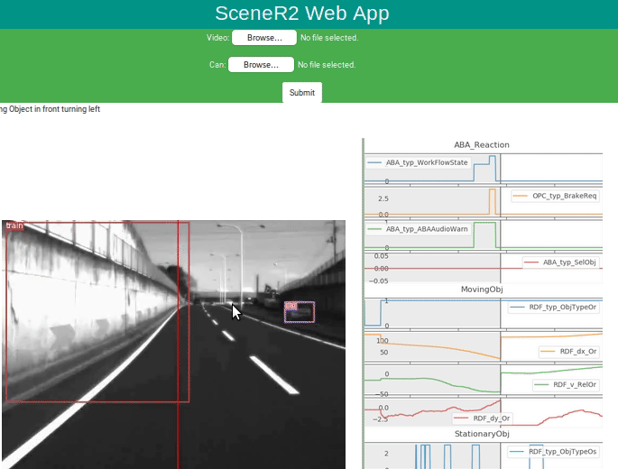

# SceneR2

A scene recognition, pedestrian detection and vehicle action detection model, with an extensive dataset encapsulation API. The API is written for proprietary data by *Daimler*.

# SceneR2WebApp

A web application in Django that takes a video and corresponding CAN data from Daimler's dataset, and processes them, shows the object detection processed video with [synced CAN](SceneR2WebApp/webapp/media/processed/can_slider.png) as a slider

 
NOTE: This code is useless for anyone except the sponsors of the project who have the coresponding data.

### To Run

* If you don't have anaconda3 already, install miniconda3 for python 3.x from [here](https://docs.conda.io/en/latest/miniconda.html)  
* Clone the repo with `git clone https://github.com/dumbPy/SceneR2.git`  
* Let `<prefix>` be the path where you cloned this git repo.  
* Change directory to repo with `cd <prefix>/SceneR2`  
* Clone the anaconda environment with `conda env update`. If that does not work i.e., if conda doesn't find the environment.txt by itself, execute `conda env -f environment.txt update`. This would take some time to download all the packages inside a new conda environment `scener2-env`.  
* Once new package environment is made, activate it with `conda activate scener2-env`  
* Now download the yolov3 weights-  
```
$ cd <prefix>/SceneR2/SceneR2/yolov3/weights  
$ ./downloads_weights.sh  
```
* Add sceneR2 to the python path for webapp to find it or add a symlink to the SceneR2WebApp folder  
```
$ cd <prefix>/SceneR2/SceneR2WebApp  
$ ln -s ../SceneR2 ./  
```
* Now you can run the web app with  
```
$ cd <prefix>/SceneR2/SceneR2WebApp  
$ python manage.py runserver 0.0.0.0:8000  
```
 This would run the SceneR2 Web Application server on your machine that can be either accesesed from same machine's browser at `localhost:8000` or from any other machine on the network with `<your-local-ip>:8000`


### Credits

Under the Supervison of **Prof. Manjesh Hanawal**<sup>1</sup>,  **Prof. P Balamurugan**<sup>1</sup> and **Dr. Tilak Singh**<sup>2</sup>\
<sup>**1**</sup>Indian Institute of Technology Bombay &nbsp;   &nbsp;  <sup>**2**</sup>Mitsubishi Fuso Truck and Bus Corp. Japan

